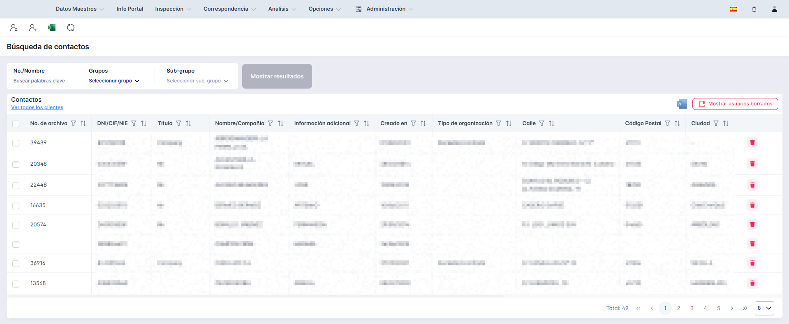

## Overview

This project is a migration of an old Windows application into a web-based platform using Angular and C#. The objective is to maintain all the functionalities of the original application,
while enhancing the user experience and accessibility by leveraging modern web technologies.

This project is a migration of an old Windows application into a web-based platform using Angular and C#. The objective is to maintain all the functionalities of the original application,
while enhancing the user experience and accessibility by leveraging modern web technologies.
This project is a migration of an old Windows application into a web-based platform using Angular and C#. The objective is to maintain all the functionalities of the original application,
while enhancing the user experience and accessibility by leveraging modern web technologies.
This project is a migration of an old Windows application into a web-based platform using Angular and C#. The objective is to maintain all the functionalities of the original application,
while enhancing the user experience and accessibility by leveraging modern web technologies.

This project is a migration of an old Windows application into a web-based platform using Angular and C#. The objective is to maintain all the functionalities of the original application,
while enhancing the user experience and accessibility by leveraging modern web technologies.
This project is a migration of an old Windows application into a web-based platform using Angular and C#. The objective is to maintain all the functionalities of the original application,
while enhancing the user experience and accessibility by leveraging modern web technologies.
This project is a migration of an old Windows application into a web-based platform using Angular and C#. The objective is to maintain all the functionalities of the original application,
while enhancing the user experience and accessibility by leveraging modern web technologies.

